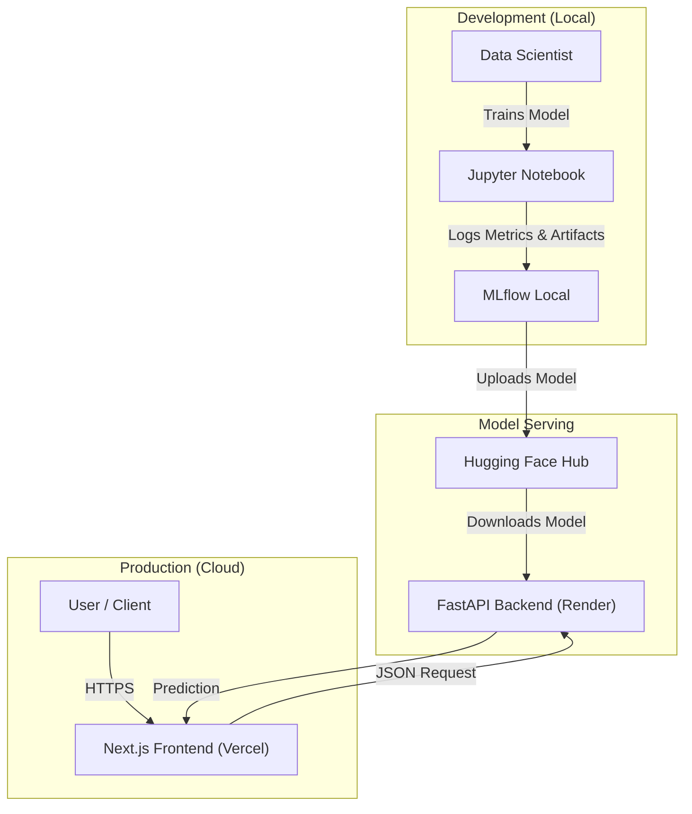

# 🔒 Real-Time Fraud Detection System

> **Production-Ready Fraud Detection System** featuring a **FastAPI** backend with **MLflow** integration, **Next.js** dashboard, and **Hugging Face** model serving.


---

## 📋 **Table of Contents**

- [Overview](#overview)
- [Key Features](#key-features)
- [Architecture](#architecture)
- [Tech Stack](#tech-stack)
- [Getting Started](#getting-started)
- [Deployment](#deployment)
- [Model Performance](#model-performance)
- [API Documentation](#api-documentation)
- [Author](#author)

---

## 🎯 **Overview**

This project demonstrates a **production-grade machine learning pipeline** for credit card fraud detection. Unlike simple notebook experiments, this system is a fully deployed application with:

1.  **Training Pipeline**: Automated training with **LightGBM** and **MLflow** tracking.
2.  **Model Registry**: Models are versioned in MLflow and deployed to **Hugging Face Hub**.
3.  **Real-Time API**: **FastAPI** backend that dynamically loads models from the cloud.
4.  **Interactive Dashboard**: **Next.js** frontend for real-time monitoring and analysis.

**Live Demo:** [Link to your Vercel App]

---

## ✨ **Key Features**

### 🎨 **Dashboard (Frontend)**
- **Real-Time Monitoring**: Live feed of recent fraud predictions.
- **Interactive Analytics**: Charts for fraud distribution and transaction trends.
- **Detailed Insights**: Drill-down view into specific transactions with risk factors.
- **Responsive Design**: Built with **Tailwind CSS** and **shadcn/ui**.

### 🧠 **Intelligent Backend**
- **Dynamic Model Loading**: Automatically fetches the latest model from **Hugging Face Hub** in production, or **MLflow** in development.
- **Robust Preprocessing**: Scikit-learn pipeline for scaling and feature engineering.
- **Health Monitoring**: Endpoints to check model status and version.

### ⚙️ **MLOps Pipeline**
- **Experiment Tracking**: Logs every training run's metrics and parameters to MLflow.
- **Model Registry**: Centralized management of model versions.
- **Cloud Storage**: Models are securely stored and served from Hugging Face Hub.

---

## 🏗️ **Architecture**



---

## 🛠️ **Tech Stack**

| Component | Technology | Purpose |
|-----------|------------|---------|
| **Frontend** | Next.js 15, React, TypeScript | Interactive Dashboard |
| **Styling** | Tailwind CSS, shadcn/ui | Modern UI Design |
| **Backend** | FastAPI, Python 3.9+ | High-performance API |
| **ML Model** | LightGBM, Scikit-learn | Fraud Detection Algorithm |
| **Tracking** | MLflow | Experiment Tracking & Registry |
| **Model Store** | Hugging Face Hub | Cloud Model Storage |
| **Deployment** | Vercel (Frontend), Render (Backend) | Cloud Hosting |

---

## 🚀 **Getting Started**

### **Prerequisites**
- Node.js 18+
- Python 3.9+
- Git

### **1. Clone Repository**
```bash
git clone https://github.com/Muhammadirfankarim/Real-Time-Credit-Card-Fraud-Detection-System.git
cd RealTime_FraudDetectionSystem
```

### **2. Backend Setup**
```bash
cd api
# Create virtual environment
python -m venv venv
source venv/bin/activate  # or venv\Scripts\activate on Windows

# Install dependencies
pip install -r requirements.txt

# Run locally (uses MLflow by default)
python main_mlflow.py
```
*Backend runs on `http://localhost:8000`*

### **3. Frontend Setup**
```bash
cd frontend
# Install dependencies
npm install

# Configure environment
cp .env.example .env.local
# Edit .env.local: NEXT_PUBLIC_API_URL=http://localhost:8000

# Run development server
npm run dev
```
*Frontend runs on `http://localhost:3000`*

---

## 🌐 **Deployment**

### **1. Backend (Render.com)**
1. Create a new **Web Service** on Render.
2. Connect this repository.
3. Set **Build Command**: `pip install -r requirements.txt`
4. Set **Start Command**: `uvicorn main_mlflow:app --host 0.0.0.0 --port $PORT`
5. Add Environment Variables:
   - `MODEL_SOURCE`: `huggingface`
   - `HF_MODEL_REPO`: `irfankarim/fraud-detection-lightgbm-v1`
   - `HF_TOKEN`: `[Your Hugging Face Token]`

### **2. Frontend (Vercel)**
1. Import this repository to Vercel.
2. Set **Root Directory** to `frontend`.
3. Add Environment Variable:
   - `NEXT_PUBLIC_API_URL`: `[Your Render Backend URL]`

---

## 📈 **Model Performance**

The current **LightGBM** model is trained on the highly imbalanced Credit Card Fraud Detection dataset.

- **Accuracy**: 99.9%
- **AUC-ROC**: 0.98+
- **Precision**: High precision to minimize false alarms.
- **Recall**: Optimized to catch maximum fraud cases.

*Training logs and detailed metrics are available in the local MLflow dashboard.*

---

## 📚 **API Documentation**

Once the backend is running, visit `/docs` for the interactive Swagger UI.

### **POST /predict**
Predicts whether a transaction is fraudulent.

**Request Body:**
```json
{
  "Time": 0,
  "V1": -1.359,
  "V2": -0.072,
  ...
  "Amount": 149.62
}
```

**Response:**
```json
{
  "prediction": "Normal",
  "confidence_score": 0.99,
  "risk_level": "Low",
  "model_version": "1"
}
```

---

## 👨‍💻 **Author**

**Muhammad Irfan Karim**

- 🌐 Portfolio: [muhammadirfankarim.my.id](https://muhammadirfankarim.my.id)
- 🐙 GitHub: [@Muhammadirfankarim](https://github.com/Muhammadirfankarim)
- 💼 LinkedIn: [Muhammad Irfan Karim](https://linkedin.com/in/muhammadirfankarim)

---

⭐ **Star this repo if you find it useful!**
